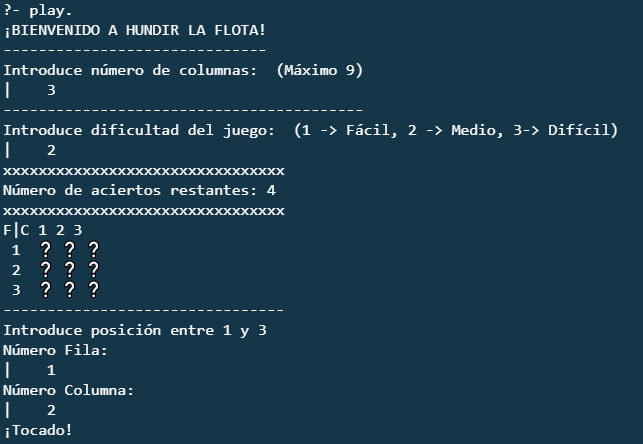
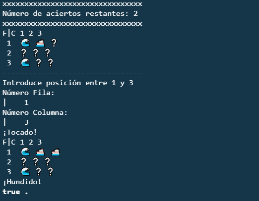
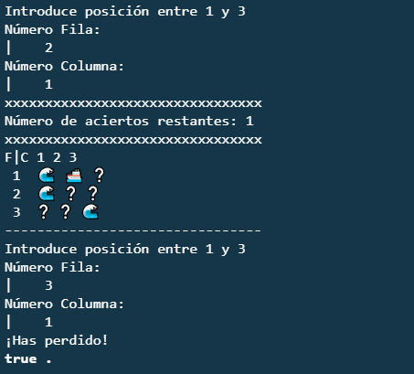

# Sink The Float
Implementation of the famous game Sink The Float in Prolog. It's implemented as we were playing vs the Machine but we don't have a board, only the Machine has.

## Index
* [About](#about)
  * [Features](#features)  
* [Usage](#usage)
  * [Example](#example)
* [Authors](#authors)
* [License](#license)

## About
The aim of the game is to guess were the boat of the opponent is. 
We only implemented 1 boat that can have 1, 2 or 3 blocks of width, depending on the difficulty we choose.

### Features
* The board is square.
* You can choose a size for the board. Maximum 9 columns. 
* You can choose a difficulty before starting the game.
* Depending on the difficulty there will be more or less attempts and the size of the boat will vary.
* In each round you can put an x/y position.
* If the attempts finish and you haven't sunk the boat you loose.
* To exit the game you can put 0 in a position.

## Usage
To play the program it's necessary to have Prolog installed. After that we can execute the program following the syntax:
```
prolog src/sink_the_float.pl
```
After that we can start the game writing:
```
play.
```
First of all we have to choose the size of the board.
Then we choose the difficulty we want.
Finally it will show the number of rounds left to guess the opponent boat.

### Example
Starting the Game



Game Finished - Win



Game Finished - Loose



## Authors
[Ángel Luis Igareta Herráiz](https://github.com/AngelIgareta)

[Cristian Abrante Dorta](https://github.com/CristianAbrante)

## License
[The Mit License.](LICENSE)
